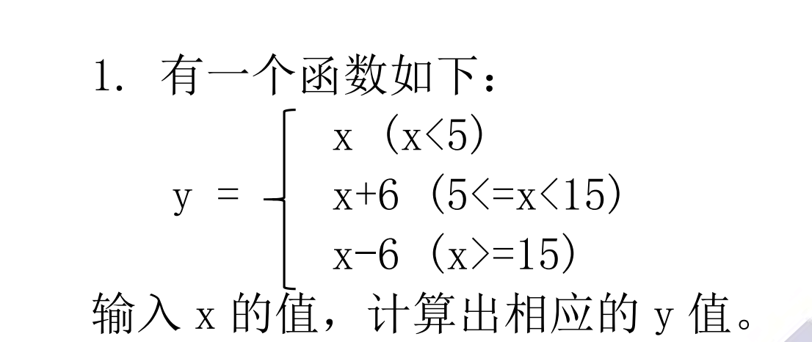
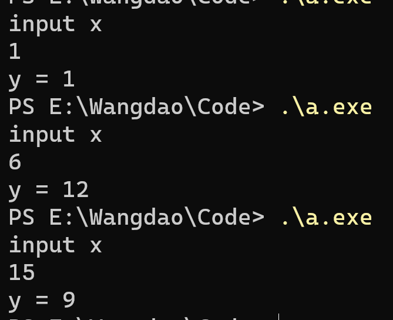
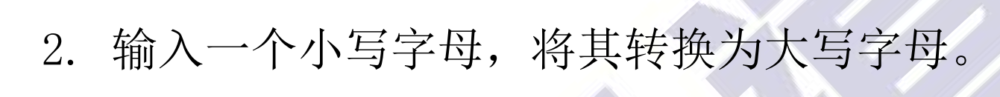

[toc]

#### 1



think:

```
分段函数，
思路1：if else if  else
思路2： 三目运算
```

code:

```c
#include  <stdio.h>
//1、使用if elseif else
#if 0
int y(int x)
{
	if(x<5)
		return x;
	else if(x>=5 && x<15)
		return x+6;
	else
		return x-6;	
}
#else
//2、使用三目运算符
int y(int x)
{
	return (x<5) ? x : (x<15) ? (x + 6) : (x - 6); 
}
#endif
int main()
{
	int x;
	printf("input x\n");
	scanf_s("%d", &x);
	printf("y = %d",y(x));
	return 0;
}
```

result：



#### 2



think:

```
1、使用ASCII码转换,小写---（-32）---大写 
2、使用库函数
3、使用位运算
```

code

```c
```

