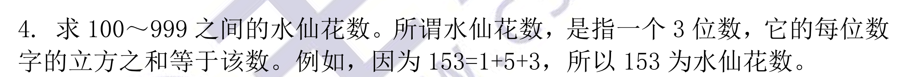
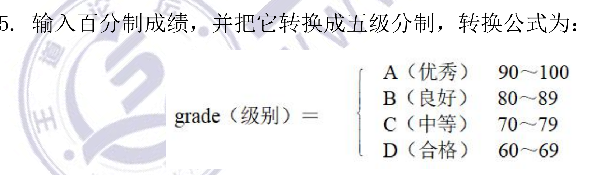

[toc]

#### 1


think:

```
分段函数，
思路1：if else if  else
思路2： 三目运算
```

code:

```c
#include  <stdio.h>
//1、使用if elseif else
#if 0
int y(int x)
{
	if(x<5)
		return x;
	else if(x>=5 && x<15)
		return x+6;
	else
		return x-6;	
}
#else
//2、使用三目运算符
int y(int x)
{
	return (x<5) ? x : (x<15) ? (x + 6) : (x - 6); 
}
#endif
int main()
{
	int x;
	printf("input x\n");
	scanf_s("%d", &x);
	printf("y = %d",y(x));
	return 0;
}
```

result：


#### 2


think:

```
输入一个小写字母，说明还得判断是不是小写字母
1、使用ASCII码转换,小写---（-32）---大写 
2、使用库函数
3、使用位运算
```

code

```c
#include  <stdio.h>
int main()
{
	char a;
	printf("input a-z\n");
	scanf("%c", &a);
	if(a>='a' && a<='z')
		a-=32;
	else
		printf("input error!\n");
	printf("output:%c\n", a);
	return 0;
}
```

result：


#### 3


think:

```
主对角元素就是行列坐标相等的元素
```


code:

```c
#include <stdio.h>
int main()
{
	int matrix[3][3];
	printf("please input a 3 x 3 matrix\n");
    //输入3X3矩阵
	for(int i=0; i<3; i++)
	{
		for(int j=0;j<3;j++)
		{
			scanf("%d", &matrix[i][j]);
		}
	}
	int sum = 0;
    //判断i=j，并求和
	for(int i=0; i<3; i++)
	{
		for(int j=0;j<3;j++)
		{
			if(i==j)
			{
				sum += matrix[i][j];
			}
		}
	}
	printf("the sum of 3 x 3 matri = %d\n", sum);
	return 0;
}

```

result:


#### 4



think:

```
1、如何拆分百位数
2、如何求立方
3、将水仙花数输出
```

code:

```c
#include  <stdio.h>
#include <math.h>
int main()
{
	int digit = 0;
	int tens = 0;
	int hundreds = 0;
	
	for(int i = 100; i<= 999; i++ )
	{
	    digit = i%100%10;
	    tens = i%100/10;
	    hundreds = i/100;
	  	if(i == pow(digit,3) + pow(tens, 3) + pow(hundreds,3))
			printf("%d \n",i);

	}
	return 0;
}
```

5、



think:

```
if else if else
```

code:

```c
```

